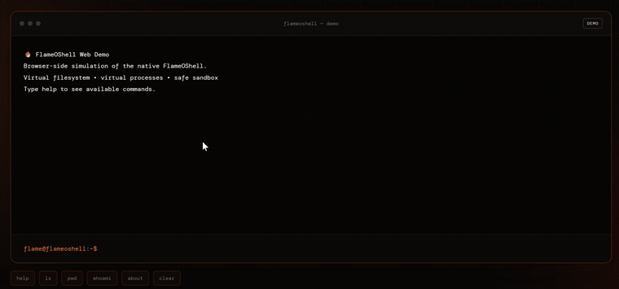

# 🔥 FlameOShell

> A lightweight Unix-like shell built in C.

FlameOShell is a custom command-line shell that brings core Unix shell functionality into a small, focused C project.

It supports process management, pipes, redirection, background jobs, job control, and signal handling.

---

## 🖥️ What is FlameOShell?

FlameOShell lets you interact with your system through a custom shell instead of using a standard shell like `bash`.

You can:

- Run programs and commands
- Run processes in the background
- Move jobs between foreground and background
- Use pipes between commands
- Redirect input and output
- Manage multiple processes
- Handle signals such as `Ctrl+C` and `Ctrl+Z`

---

## ⚡ Features

### 💻 Command Execution

Run normal Linux/Unix commands directly from FlameOShell.

```bash
ls
pwd
cat file.txt
echo Hello
```

### 🧩 Built-in Commands

| Command | Description |
|---|---|
| `pwd` | Display the current working directory |
| `cd` | Change the current directory |
| `jobs` | Display active background jobs |
| `bg` | Resume a stopped job in the background |
| `fg` | Bring a background job to the foreground |
| `exit` | Close FlameOShell |

### 🚀 Background Processes

Run programs without blocking the shell:

```bash
sleep 10 &
```

### 🎮 Job Control

Manage processes between the foreground and background:

```bash
jobs
bg
fg
```

### 📥 Input Redirection

Read input from a file:

```bash
cat < input.txt
```

### 📤 Output Redirection

Write command output to a file:

```bash
ls > output.txt
```

### 🔗 Pipes

Connect multiple commands together:

```bash
ls | grep ".c"
```

or:

```bash
cat file.txt | grep hello
```

### ⚙️ Signal Handling

FlameOShell handles common terminal signals such as:

- `Ctrl+C` — interrupt a running process
- `Ctrl+Z` — stop a running process

---

## 🧪 Try It Out

### 1. Clone the repository

```bash
git clone https://github.com/raynerdcunha/flameoshell.git
cd flameoshell
```

### 2. Build FlameOShell

```bash
make
```

### 3. Start the shell

```bash
./flameoshell
```

You should now be inside FlameOShell.

Try:

```bash
pwd
ls
echo Hello
ls | grep ".c"
```

---

## 🚪 Closing FlameOShell

When you're finished, run:

```bash
exit
```

You can also use:

```text
Ctrl+C
```

depending on what is currently running.

---

## 🧹 Clean the Build

To remove the compiled executable:

```bash
make clean
```

Then rebuild whenever you want:

```bash
make
```

---

## 🧩 How It Works

At a high level, FlameOShell follows the basic shell workflow:

```text
User Input
    ↓
Parse Command
    ↓
Check Built-in Commands
    ↓
Create Processes
    ↓
Set Up Pipes / Redirection
    ↓
Execute Program
    ↓
Manage Foreground / Background Job
    ↓
Return to Shell
```

---

## 🛠️ Under the Hood

FlameOShell uses several Unix/Linux system calls and concepts, including:

- `fork()` — create processes
- `execve()` — execute programs
- `waitpid()` — wait for processes
- `pipe()` — create communication channels
- `open()` — access files
- `dup()` / `dup2()` — redirect file descriptors
- `kill()` — send signals to processes
- `sigaction()` — handle signals
- `setpgid()` — manage process groups

---

## 🎬 Demo

A web/demo version of FlameOShell will be added here.

## 🌐 Web Version

Try the interactive browser-based demo of FlameOShell:

👉 **[Launch FlameOShell](https://flameoshell.vercel.app/)**

The web version provides a browser-side simulation of the shell, including a virtual filesystem, command execution, pipes, redirection, background jobs, and job control.

Screenshots and GIFs can also be added here later:

```markdown

```

---

## 🌐 Web Version

A web version of FlameOShell is planned for:

**https://flameoshell.vercel.app**

The goal is to eventually provide a browser-based experience with:

- 🖥️ Interactive terminal
- 📖 Command documentation
- 🎨 FlameOShell interface
- 🧪 Interactive examples
- 📱 Responsive design

The native C shell will remain the core project, while the website will provide a way to explore and interact with it online.

---

## 🗺️ Roadmap

### 🔥 Core Shell

- [x] Command execution
- [x] Built-in commands
- [x] Background processes
- [x] Job control
- [x] Input redirection
- [x] Output redirection
- [x] Pipes
- [x] Signal handling

### 🚀 Future Ideas

- [ ] Command history
- [ ] Tab completion
- [ ] Environment variable support
- [ ] Improved command parsing
- [ ] Better error messages
- [ ] More built-in commands
- [ ] Improved terminal UI

### 🌐 Web Version

- [x] Landing page
- [x] Interactive terminal
- [x] Deploy to Vercel
- [ ] Command documentation
- [ ] Demo section

---

## 🍴 Fork & Run

Want your own copy?

```bash
git clone https://github.com/raynerdcunha/flameoshell.git
cd flameoshell
make
./flameoshell
```

Or fork the repository and build your own version of FlameOShell.

---

## 🤝 Contributions

Ideas, improvements, and experiments are welcome.

Feel free to fork the project, make changes, and open a pull request.

---

## 📄 License

This project is licensed under the **Apache License 2.0**.

See the [`LICENSE`](LICENSE) file for details.

---

<p align="center">
  🔥 <strong>FlameOShell</strong> — small shell, big Unix energy.
</p>
